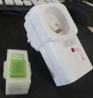

[English](https://madnerdorg.github.io/radio433/)

[](https://madnerdorg.github.io/libreconnect/doc/fr/devices)   
[Download Radio433](https://github.com/madnerdorg/radio433/archive/master.zip) /  [LibreConnect](https://madnerdorg.github.io/libreconnect/) /[Source](https://github.com/madnerdorg/radio433)

- [C'est quoi Radio433 ?](#cest-quoi-radio433-)
- [Applications](#applications)
- [Comment fabriquer radio433](#comment-fabriquer-radio433)
- [Commandes](#commandes)

# C'est quoi Radio433 ?
        
Radio433 est un appareil qui permet de recevoir et envoyer plusieurs types de communications radio en 433Mhz (ou 315Mhz)         
Protocôles géré: RemoteTransmitter (old)/NewRemoteTransmitter (new)/RadioHead (text)      
# Applications
[](https://www.youtube.com/watch?v=JnwSQTdr2jQ)

## Domotique
[Exemple Domotique](http://madnerd.org/interface/homeautomation)     

* Contrôler des prises de courants à bas prix    
* Contrôler des lampes
* Envoyer du texte entre des arduino/raspberry pi   

## Appareils compatibles
Voici quelques indications des appareils compatibles
   
   
Pour plus d'informations sur les appareils compatibles: [https://bitbucket.org/fuzzillogic/433mhzforarduino/](https://bitbucket.org/fuzzillogic/433mhzforarduino/)

Cette technologie n'est pas très fiable mais est utile si vous voulez éteindre/allumer des prises de courants à distance pour pas cher.

# Comment fabriquer radio433

## Téléverser le code
* Copier **radio433 / libraires** dans votre carnet de croquis arduino (Documents/Arduino)
* Téléverser **radio433/radio433.ino**   
* Aller sur http://madnerd.org/interface/homeautomation

## Composants
* Receiver : ASK Receiver Super-heterodyne  OOK RF - 4€
* Transmitter : ASK transmitter - 2€
* Arduino nano ch340g - 2€
> Coût total: 9€

## Branchements
        


## Modèles 3D
[Afficher les modèles](https://github.com/madnerdorg/radio433/tree/master/stl)

# Commandes
* /info : Affiche nom:port (radio433:42002)  
* /status : Affiche l'état (en json)  
```
{"file":"radio2serial.ino","url":"github.com/madnerdorg/radio433","ver":"1.2","pins":"tx:10;rx:2","state":"tx:1;rx:1"}
```
## Recevoir des codes radio
La manière la plus simple d'obtenir les codes de vos prises de courant est d'utiliser la télécommande fourni avec.

Les données reçus sont en JSON 
```
{"data" : "/radio/text/Hello World"}
```

## Envoyer des codes radio
Envoyer un messagee RadioHead (virtualwire)
```
/radio/text/Hello World
```
Allumer un appareil radio "new" "addresse:1234 unité:1" 
```
/radio/new/1234/1/on
```
Eteindre un appareil radio "new" "addresse:1234 unité:0"
```
/radio/new/1234/0/off
```
Règler la luminosité à 8/16 "addresse:1234 unité:2"
```
/radio/new/1234/2/8
```
Envoyer un code "old" "123456"
```
/radio/old/123456
```

# Licenses

radio433.ino      

|Auteur                 | Rémi Sarrailh                                    |
|:---------------------:|:------------------------------------------------:|
|License                | MIT                                              |

RadioHead Library      

|Auteur                 | Ayrspace                                         |
|:---------------------:|:------------------------------------------------:|
|License                | MIT                                              |
|Donation               | http://www.airspayce.com                         |
|Documentation (ENGLISH)| http://www.airspayce.com/mikem/arduino/RadioHead/|


433MhzForArduino Library     

|Auteur                 | Randy Simons                                                |
|:---------------------:|:-----------------------------------------------------------:|
|License                | MIT                                                         |
|Donation               | Bitcoin: 1Ar433MfHWV7a4yGj3avg3dpTRzHGvT4PP                 |
|Documentation (ENGLISH)| https://bitbucket.org/fuzzillogic/433mhzforarduino/         |

