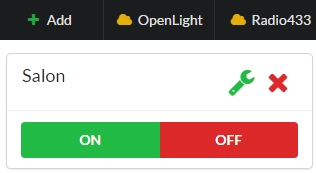
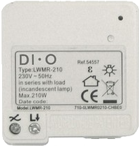
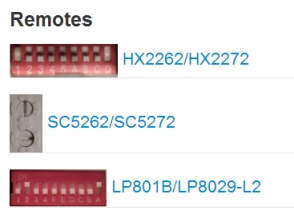
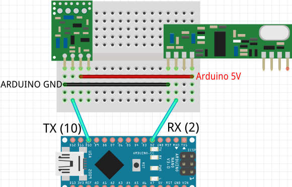
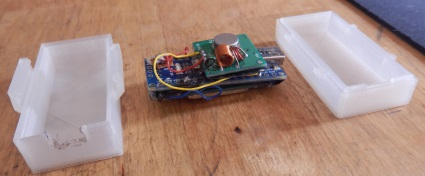

[Français](https://madnerdorg.github.io/radio433/readme.fr)

[](https://madnerdorg.github.io/libreconnect/doc/en/devices)   
[Download Radio433](https://github.com/madnerdorg/radio433/archive/master.zip) /  [LibreConnect](https://madnerdorg.github.io/libreconnect/) /[Source](https://github.com/madnerdorg/radio433)

- [What is Radio433](#what-is-radio433)
- [Applications](#applications)
- [How to build radio433](#how-to-build-radio433)
- [Commands](#commands)


# What is Radio433
----
        
Radio433 is a device to receive multiples 433Mhz (or 315Mhz) types of radio communications.      
Protocols managed: RemoteTransmitter (old)/NewRemoteTransmitter (new)/RadioHead (text)      

# Applications
[](https://www.youtube.com/watch?v=JnwSQTdr2jQ)
## Home Automation
[Home Automation Example](http://madnerd.org/interface/homeautomation)     

* Control Cheap Power Outlets 
* Control lamps   
* Send text between arduino/raspberry pi   

## Compatible devices
Here is some compatibles devices    
   
   
For more information on compatible devices: [https://bitbucket.org/fuzzillogic/433mhzforarduino/](https://bitbucket.org/fuzzillogic/433mhzforarduino/)

This technology (433Mhz) isn't really reliable but this is pretty useful if you want to turn on/off power outlets remotely and cheaply.

# How to build radio433

## Upload code
* Copy **radio433 / libraires** into arduino sketchbooks (Documents/Arduino)    
* Upload **radio433/radio433.ino**   
* Test it on [http://madnerd.org/interface/homeautomation](http://madnerd.org/interface/homeautomation)

## Components
* Receiver : ASK Receiver Super-heterodyne  OOK RF - 4€
* Transmitter : ASK transmitter - 2€
* Arduino nano ch340g - 2€    
> Cost: 9€

## Wiring



## 3D models
[Show Models](https://github.com/madnerdorg/radio433/tree/master/stl)


# Commands
* /info : Display name:port (radio433:42002)  
* /status : Display status (in json)  
```
{"file":"radio2serial.ino","url":"github.com/madnerdorg/radio433","ver":"1.2","pins":"tx:10;rx:2","state":"tx:1;rx:1"}
```
## Receive radio
The easiest way to get codes from power outlets is to use the remote provided with it

Data are received in JSON 
```
{"data" : "/radio/text/Hello World"}
```

## Send radio
send RadioHead code "Hello world"
```
/radio/text/Hello World
```
turn on new radio "address:1234 unit:1" 
```
/radio/new/1234/1/on
```
turn off new radio "address:1234 unit:0"
```
/radio/new/1234/0/off
```
dim new radio to 8/16 "address:1234 unit:2"
```
/radio/new/1234/2/8
```
send old radio code "123456"
```
/radio/old/123456
```

# Licences

radio433.ino      

|Author                 | Rémi Sarrailh                                    |
|:---------------------:|:------------------------------------------------:|
|License                | MIT                                              |

RadioHead Library      

|Author                 | Ayrspace                                         |
|:---------------------:|:------------------------------------------------:|
|License                | MIT                                              |
|Donation               | http://www.airspayce.com                         |
|Documentation (ENGLISH)| http://www.airspayce.com/mikem/arduino/RadioHead/|


433MhzForArduino Library     

|Author                 | Randy Simons                                                |
|:---------------------:|:-----------------------------------------------------------:|
|License                | MIT                                                         |
|Donation               | Bitcoin: 1Ar433MfHWV7a4yGj3avg3dpTRzHGvT4PP                 |
|Documentation (ENGLISH)| https://bitbucket.org/fuzzillogic/433mhzforarduino/|

